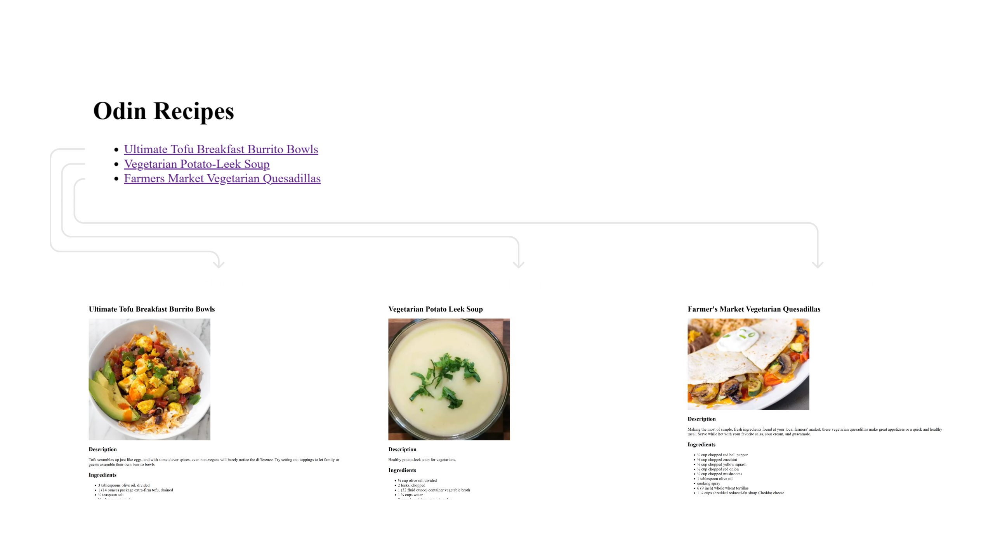
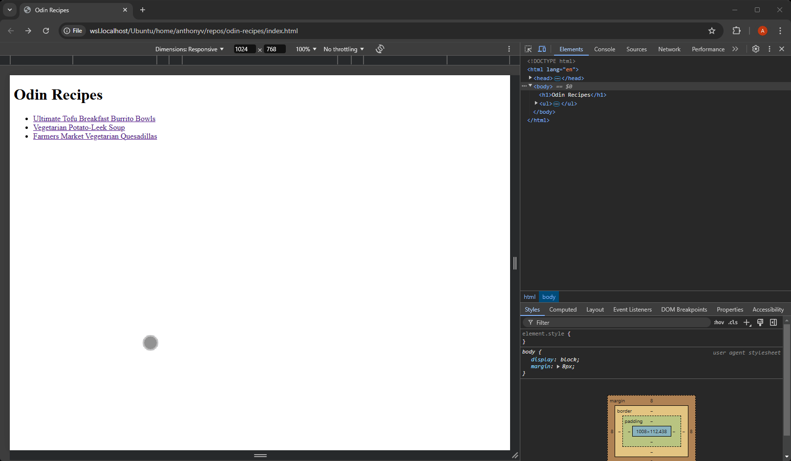

# Project: Recipes

## Description

- In this project, I created a basic recipe website using HTML
- Live preview: https://averdonks.github.io/odin-recipes/

## Skills

HTML
- Text
- Lists
- Links and images

Git
- Version control

## Diagram

## Video Demo

## Reflection

Completing this project made me more comfortable with using HTML to build out the structure of webpages and using Git for version control. I look forward to completing many more projects thoughout my odin project journey!

## Updates

- 1/4/2025 - Add [version 2.0](https://averdonks.github.io/odin-recipes/index-v2.html) with some basic CSS additions